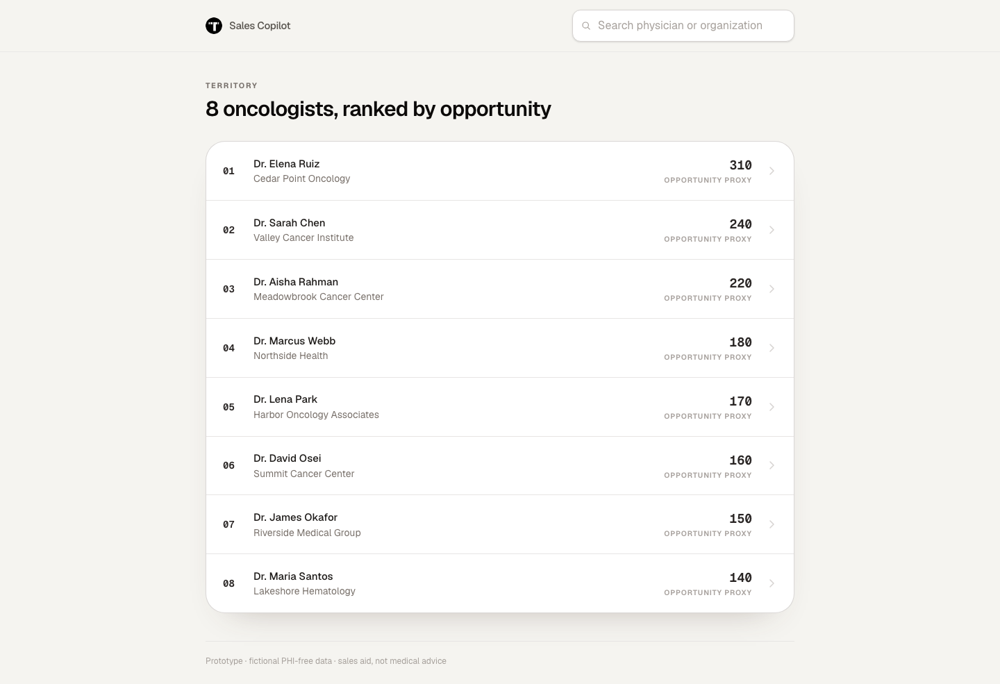
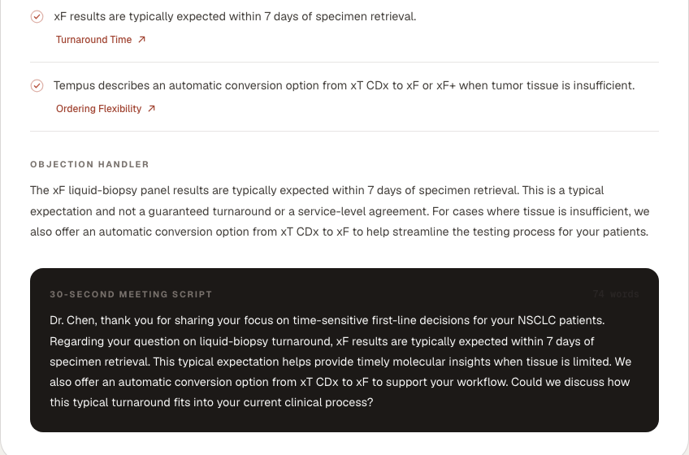
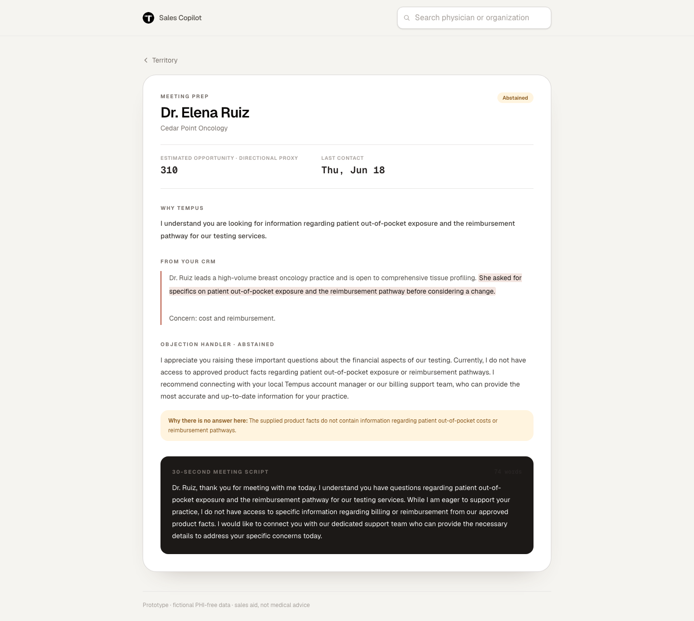

# Tempus Sales Copilot (prototype)

Meeting prep for a Tempus territory sales rep.
**Ranked territory → pick an oncologist → get a grounded brief.**

### ▶ [Live demo](https://tempus-sales-copilot-jklin1206-gmailcoms-projects.vercel.app) · [Spec](SPEC.md) · [Prompt log](prompts/CHANGELOG.md)

Every product claim is checked against a sourced fact before it renders.
If a claim can't be verified, the whole brief is thrown away.
If the approved facts can't answer the physician's question, the copilot says so instead of reaching for something adjacent.

It's a **bounded grounded-generation workflow, not an agent**: the steps are fixed in code, and the model only chooses words — never control flow.

---

## What it looks like

**The territory.** Sorted by patient population, physician ID as tie-break. That's the whole algorithm — no model, no score.



<details>
<summary><b>Why a plain sort, and not a 1–100 "sales potential score"?</b> The brief asks for a list <i>ordered by impact</i> — so what is impact?</summary>

<br>

**Expected value = impact × propensity.**

- **Impact is a magnitude**, and the data supplies exactly one: `likely_patient_population`. A 310-patient practice adopting Tempus moves more volume than a 140-patient one. That's arithmetic on a supplied column, and it's the term the brief asked to sort by.
- **Propensity is the term nobody was given.** No conversion history, no won/lost, no engagement data. Nothing to fit to, nothing to validate against.

A score blending population with CRM sentiment ("dissatisfied with turnaround → hotter lead") is answering *propensity*, not impact — a buying-readiness proxy wearing an impact label. And it can't be calibrated here: all 8 CRM notes carry exactly one concern each, and all 8 are distinct, so the score fits weights to **eight unlabeled points across eight one-off categories**. It would look calibrated and be unfalsifiable. *Why 87 and not 74?* has no answer.

**The CRM signal isn't ignored — it's used where it can be checked.** It picks the products, the facts, the objection, and the script, and every claim it produces is validated against the vault. It stays out of the ranking because a ranking has no validator.

**What would earn the second term:** outcome labels from Salesforce, plus the catalyst feed. Then expected value is *measured* rather than asserted. That's a data problem before it's a model problem.

</details>

**A grounded brief.** Each talking point links to the Tempus page it came from. Script is held to 65–80 words.

The model wrote *"a typical expectation and not a guaranteed turnaround"* on its own. The validator only requires the word "typically" to survive from the source fact — the disclaimer was the model's idea, and it's true, so it stands.



**The abstention.** Dr. Ruiz asks about out-of-pocket cost. The copilot declines and routes to a human.

Not a special case in the prompt — the vault contains **no pricing fact at all**, so nothing in it *can* answer her. A test asserts none is ever added.



---

## Run it

```bash
npm install
npm run dev      # http://localhost:3000
```

**Works with no API key.** It runs in demo mode: every provider opens a bundled brief labeled "Prerecorded." Those are real recorded model output that passed the same validator — none is hand-written.

For live generation, copy `.env.example` to `.env` and set `GOOGLE_GENERATIVE_AI_API_KEY`.

> Gemini's free tier allows 500 requests/day. A few eval runs will spend it. When it's gone the app says so plainly rather than hanging.

---

## The big tradeoff: RAG's shape, with the retriever left out

Split the acronym and the answer gets precise.

**Augmented generation — yes.** The model is grounded in external knowledge read off disk at request time, never in its own weights. It may not assert anything the supplied facts don't support, and a validator enforces that.

**Retrieval — deliberately not.** No embeddings, no similarity, no top-k. All 34 facts go into every request, whatever the physician asked.

So this is **RAG's architecture with the retriever set to the identity function** — and that's not a dodge, it's literally the seam:

```ts
interface KnowledgeProvider {
  getContext(input: { physicianId: string }): Promise<KnowledgeContext>;
}

class FullVaultKnowledgeProvider implements KnowledgeProvider {}   // retrieve everything (today)
class IndexedKnowledgeProvider implements KnowledgeProvider {}     // retrieve selectively (later)
```

At this size, retrieve-everything strictly dominates a retriever:

- **The corpus fits.** 34 facts + the CRM note ≈ **6,500 tokens**, comfortably in one prompt. Retrieval solves "the corpus is too big to send." This one isn't.
- **Perfect recall, by construction.** A retriever's job is deciding which facts the model *never sees*. Miss once and the brief is missing the fact that answered the question — and no validator can catch that, because it can only check claims that were made. Retrieve-everything cannot miss.
- **Every qualifier stays in front of the validator.** Grounding depends on words like *typically* and *retrospective* surviving from fact into prose. The whole vault is present at validation time, so every claim can be checked against its source. Chunking puts that at the mercy of a chunk boundary.

**Where it breaks:** past a few hundred facts, when the corpus stops fitting and the model's attention thins. That's when a retriever starts paying for itself — and swapping `IndexedKnowledgeProvider` in behind the same interface doesn't move the brief contract, the validator, or the evals.

The honest summary: the *R* is the one piece of RAG this doesn't need yet, so it's the one piece that isn't built.

---

## Other tradeoffs

| Decision | Choice | Cost |
|---|---|---|
| A brief fails validation | **Discard all of it.** Blocking the pitch means blocking every sentence. | The rep sometimes gets an error, not a brief. |
| Who checks grounding | **A mechanical validator, not an LLM judge.** A model checking a model gives you two things that can hallucinate. | Brittle string rules. Four times the harness was wrong and the model was right. |
| A rejected draft | **One repair call, shown exactly which checks failed.** A redraw learns nothing. | One extra call of latency. |
| Ranking | **A plain sort by population.** Impact is a magnitude; that's the only one the data has. | No propensity term — but there's no data to build one from, and a 1–100 lead score would be unfalsifiable. |
| "Why now" | **Absent, and said so.** It needs a governed catalyst feed the data doesn't have. | No dated reason to call today. An invented one would be worse. |
| Pricing questions | **Abstain, route to a human.** | Can't answer the most common objection in the CRM notes. It says so. |
| What the browser gets | **Finished prose + one source link per claim.** No fact IDs, no vault, no trace. | The rep can't audit grounding. Deliberate: it's a guarantee, not homework. |
| No API key | **Demo mode is a mode, not a fallback.** A live failure is reported as a failure. | An outage shows an error where a recording would have looked fine. |

Caching, rate limiting, and provider adapters are infrastructure, not product judgment. They live in [`SPEC.md`](SPEC.md).

---

## How it works

```
POST /api/brief
  1. Reject unknown physician IDs.
  2. Demo mode? Serve the bundled brief, stop.
  3. Load one CRM note + the complete vault.
  4. One structured model call.
  5. Blocking validation.
  6. Rejected? One repair call, shown the failed checks. Validate again.
  7. Still rejected? Every field emptied, and the rep is told.
```

Three gates on the way out:

| Gate | Where | Question |
|---|---|---|
| **Structure** | `brief/schema.ts` | Right shape? (JSON schema, enforced on the model) |
| **Truth** | `validation/validate.ts` | True, against this physician's note and the vault? |
| **Exposure** | `toClientBrief()` | Allowed to reach the browser? |

The truth gate is mechanical: every cited fact exists, the CRM excerpt is a verbatim substring of *that* physician's note, every number traces to a cited fact, required qualifiers survive, and no guaranteed-turnaround / competitor / superiority / clinical / pricing claim appears.

**The repair pass.** A rejected draft gets one more call — not a redraw. It's shown its own output and told what failed, in words it can act on:

> *These numbers appear in your prose and no fact you cited states them: 3.*

rather than `numbers_trace_to_cited_facts`. The repair is gated by the same validator, so it can't launder a bad brief.

---

## How well it works

On `gemini-3.1-flash-lite`:

| | Result |
|---|---|
| Deterministic checks | **8 / 8** |
| Golden scenarios, single-shot | 7/8, 8/8, 7/8, 8/8 |
| Golden scenarios, with repair | **8 / 8** |
| Unit + contract tests | **116** |

```bash
npm test
npm run eval                  # single-shot: what the prompt earns alone
npm run eval -- --live --product   # with the repair pass: what a rep gets
```

Both numbers are reported on purpose. Quoting only the second would flatter the prompt.

Single-shot misses are usually a dropped qualifier or a script a few words short — real defects the validator is right to catch. Loosening the checks would just ship the overclaims.

---

## Assumptions

1. **"Provider" = the oncologist**, not the institution.
2. **The data can't answer "why now," and I didn't invent it.** Market volume, product facts, and a CRM snapshot are all timeless. A real "why now" needs a governed, dated catalyst feed ([`SPEC.md` §17](SPEC.md)).
3. **The prototype begins after ingestion.** The CSV/Markdown are versioned snapshots; no Salesforce, scraping, or DB.
4. **`likely_patient_population` is a directional proxy.** It orders a list. It never influences which product a brief discusses.
5. **Everything is fictional and PHI-free.** A sales aid, not clinical decision support.

---

## Layout

```text
data/                     8 fictional oncologists + 8 PHI-free CRM notes
knowledge-vault/          34 sourced facts across 4 product notes
prompts/                  meeting-prep-v1..v4 + the refinement log
fixtures/briefs/          one recorded, validated brief per provider (demo mode)
src/lib/brief/generate.ts the workflow: draft → validate → repair once → or block
src/lib/validation/       the blocking validator
src/lib/generation/       the prompt, the repair pass, the Gemini adapter
src/lib/knowledge/        the KnowledgeProvider seam (where retrieval would go)
evals/                    8 golden scenarios + the harness
deck/                     walkthrough deck and screenshots
```

Product facts are curated from public Tempus pages and have **not** been through medical, legal, or regulatory review.
The golden scenarios are author-labeled regression coverage, not a claim of real-world accuracy.
